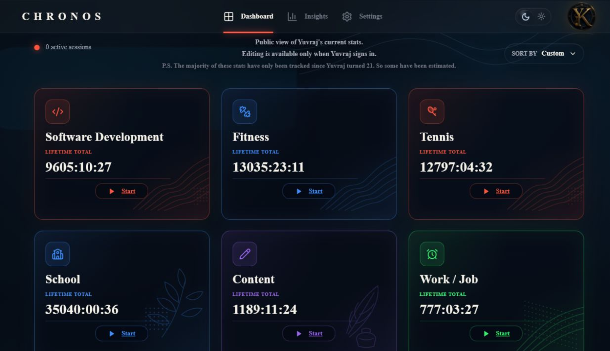
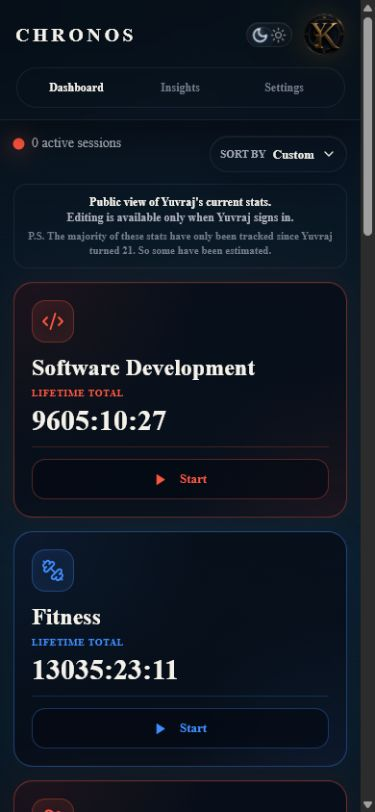
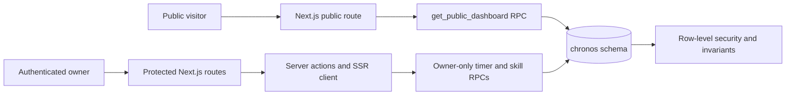

# Chronos

Chronos is my live time-investment ledger: a public proof-of-work dashboard backed by a private, owner-operated timer and session system. I designed, built, and operate it to answer a harder question than “where did today go?” — **what have I consistently invested in over years?**

[View the live product](https://chronos.yuvrajkashyap.com) · [Read the architecture](docs/architecture.md) · [Review the methodology](docs/methodology.md)



## Why it exists

Most timers optimize a single day. Chronos keeps durable lifetime totals across long-running areas such as software development, fitness, school, and work while preserving the session history behind those totals. It separates the public evidence layer from the private operating layer, so the product can be useful every day without publishing sensitive activity.

This is a real product that I still use, not a synthetic demo. The public dashboard reads public-safe data from production. If that data source is unavailable, Chronos now shows an explicit availability notice instead of substituting sample numbers.

## Product decisions

- **One source of truth.** Lifetime totals and sessions live in PostgreSQL rather than browser storage.
- **One active investment at a time.** A database constraint and timer RPCs prevent overlapping active sessions.
- **Intentional stopping.** Completed timers can be counted toward lifetime investment or skipped, keeping accidental time separate from accepted time.
- **Public by projection, private by default.** Anonymous visitors receive only the allowlisted dashboard projection; owner routes and mutations require an authenticated, allowlisted user.
- **Long horizons without false precision.** Chronos distinguishes tracked session data from lifetime totals that may include explicitly acknowledged historical estimates.
- **Safe degradation.** Missing configuration or unavailable public data produces an honest status message, never fabricated dashboard values.

## What is implemented

- Responsive public dashboard with live lifetime totals, active-state display, sorting, and dark/light appearance
- Supabase SSR authentication with an owner allowlist
- Skill creation, editing, archive controls, drag reordering, and manual lifetime adjustments
- Start/stop timer flows, count-or-skip confirmation, recent sessions, and automatic downtime tracking
- Public-safe and authenticated insight surfaces derived from the available data
- Row-level security, schema-scoped grants, and SECURITY DEFINER RPCs with fixed search paths
- Metadata, sitemap, robots policy, and security headers for the deployed web surface
- Automated lint, strict TypeScript, unit tests, dependency audit, and production build checks

The same public proof surface is intentionally usable on a phone without exposing owner controls:

<p align="center">
  
</p>

## System at a glance



The public read path never queries owner tables directly. Mutating paths run on the server, validate the session, and rely on database authorization and invariants as the final enforcement layer. See [docs/architecture.md](docs/architecture.md) for the detailed boundaries.

## Local development

Requirements: Node.js 22 or newer, npm, and a Supabase project with the Chronos schema applied.

```bash
git clone https://github.com/YuvrajKashyap/chronos.git
cd chronos
npm ci
cp .env.example .env.local
npm run dev
```

Configure the values described in [.env.example](.env.example). A Supabase publishable key is preferred; the legacy anon key remains supported during migration. Owner credentials and service-role keys must never be committed or exposed to client code.

The app can build without Supabase variables. In that state, public pages render an availability notice and private authentication remains unavailable.

## Verification

```bash
npm run check
npm audit
```

`npm run check` runs ESLint with zero warnings, strict TypeScript, the Vitest suite, and a production Next.js build. GitHub Actions runs the same gate on every push to `main` and every pull request.

Current unit coverage targets the highest-leverage pure logic: long-duration formatting, public dashboard ordering and active-state calculations, and insight aggregation across counted, skipped, pending, private, and daily session data.

## Data integrity and privacy

The public dashboard is evidence, but it is not presented as laboratory-grade measurement. Some lifetime baselines predate Chronos and are visibly labeled as estimates in the product; later timer sessions provide the stronger audit trail. The repository does not contain production data, credentials, or generated demo totals.

Read [docs/data-provenance.md](docs/data-provenance.md) for the exact provenance boundary and [docs/methodology.md](docs/methodology.md) for calculation rules.

## Known boundaries

- Chronos is intentionally single-owner today; it is not a multi-tenant SaaS product.
- The repository contains a timestamped migration chain, including later analytics primitives. A deployment must verify its actual database migration state before enabling code that depends on newer columns or functions.
- Lifetime estimates from before structured tracking are acknowledged but are not yet tagged individually in the schema.
- Private insights are only as complete as the session fields present in the deployed schema; the UI degrades when optional analytics fields are unavailable.
- Settings is a protected product surface under development, not a finished account-management suite.

## Stack

- Next.js App Router and React
- TypeScript
- Supabase Auth, SSR clients, PostgreSQL, RLS, and RPCs
- Vitest and ESLint
- Vercel and GitHub Actions

## Repository map

```text
src/app/                 routes, metadata, auth callback, and server actions
src/components/chronos/  dashboard, timer, forms, insights, and responsive UI
src/lib/chronos/         transforms, formatting, data loaders, and analytics
src/lib/supabase/        environment and SSR/browser client boundaries
supabase/migrations/     ordered schema, policies, constraints, and RPC changes
docs/                    architecture, methodology, and data provenance
```

## Ownership

Chronos is an independent project designed, implemented, and operated by [Yuvraj Kashyap](https://github.com/YuvrajKashyap). It is published here as a technical case study and working product; no open-source license is granted.
