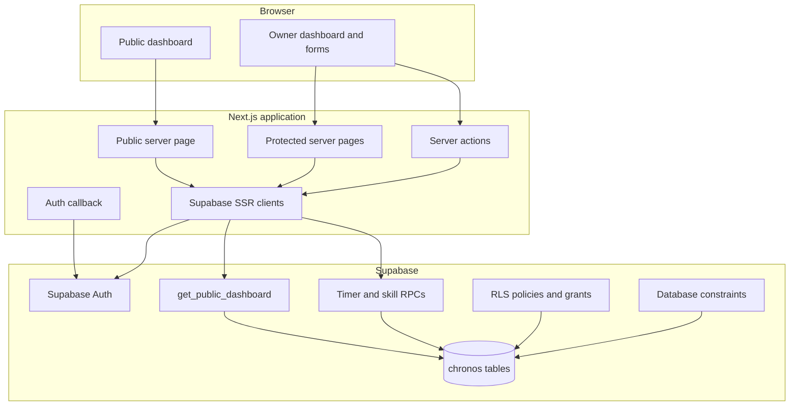
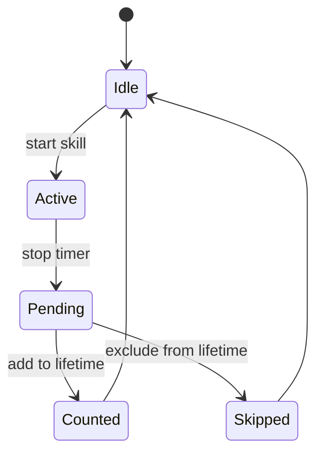

# Architecture

Chronos is a Next.js application over a dedicated PostgreSQL schema in a shared Supabase project. The architecture is deliberately server-led: browsers render the interface and submit intent, while authorization, timer exclusivity, and durable accounting live behind the server boundary.

## Runtime boundaries

## Public read path

The root dashboard is server-rendered. It calls the anonymous-safe `chronos.get_public_dashboard()` function and transforms that payload into display models. That RPC is the only intended anonymous data path: it projects visible skills and excludes private and downtime records.

If configuration is missing, the request fails, or the payload contains no useful rows, the page renders no cards and explains that live data is unavailable. It does not fall back to sample totals.

## Authenticated path

Supabase SSR clients use request cookies to resolve the current user. Protected routes require a verified user and the database independently checks the Chronos owner allowlist. Browser submissions enter Next.js server actions; the actions validate input, call schema-scoped RPCs, and revalidate affected routes after successful mutations.

The application never ships a service-role credential to the browser. Public configuration is limited to the Supabase URL and a publishable or legacy anon key.

## Timer accounting

Timer operations are transactional database functions. The schema uses a partial unique index to prevent more than one active session for the owner. Stop flows close the timer before the user classifies the resulting duration:

This state model separates elapsed observation from accepted lifetime investment. Automatic downtime functions preserve the gap between explicit sessions without presenting downtime as public progress.

## Database defense in depth

- Chronos objects remain in the `chronos` schema rather than `public`.
- RLS is enabled on application tables.
- Owner rows are anchored to `auth.uid()` and the active-user allowlist.
- Anonymous access uses a narrow public projection function rather than direct table reads.
- Mutation functions use a fixed `search_path` and explicit grants.
- Timer uniqueness is a database invariant, not a UI assumption.
- Migrations are ordered and forward-only; the foundation rollback is intentionally destructive and documented as manual-only.

## Deployment and configuration

Vercel hosts the Next.js application. Supabase hosts authentication and the database. GitHub Actions verifies a clean npm install, lint, strict TypeScript, tests, and the production build before a change is considered healthy.

Environment resolution prefers `NEXT_PUBLIC_SUPABASE_PUBLISHABLE_KEY` and falls back to `NEXT_PUBLIC_SUPABASE_ANON_KEY` for existing deployments. `NEXT_PUBLIC_SITE_URL` controls canonical metadata; the production URL is the safe default.

## Migration discipline

The files in `supabase/migrations/` describe the intended evolution of the Chronos schema. Because Chronos shares infrastructure with other projects and contains real data, migrations are not applied automatically as part of a frontend deployment. Operators must:

1. Confirm the target project and current migration state.
2. Review the exact SQL delta and its rollback implications.
3. Back up affected production data.
4. Apply migrations in timestamp order.
5. verify functions, grants, policies, and a real timer flow.

Application code that depends on optional later analytics fields must tolerate their absence until that verification is complete.
